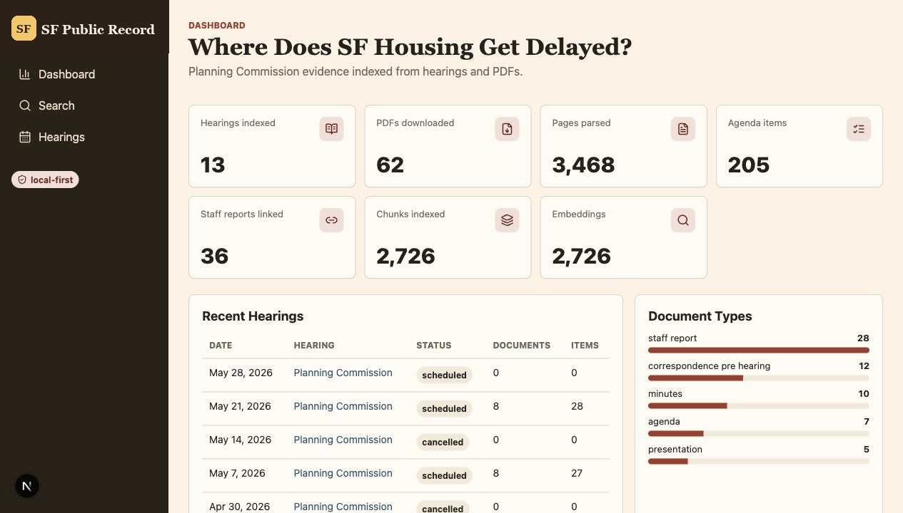

# SF Public Record

SF Public Record is a local-first civic document intelligence project for San Francisco Planning Commission materials.

AI-assisted accountability for San Francisco planning records.

The app is intentionally not a generic "chat with PDFs" wrapper. The core model is civic and source-first:

```text
hearing -> agenda item -> case/project -> supporting documents -> pages/chunks/evidence
```

Milestone 5 implements the local-first MVP: DuckDB initialization, CPC crawling, supporting-document discovery, idempotent PDF downloads, PDF text extraction, agenda item parsing, structure-aware chunking, embeddings, hybrid search, FastAPI routes, and a Next.js frontend.



## Public Alpha Notes

- SF Public Record is an independent research project. It is not affiliated with or endorsed by the San Francisco Planning Department, the Planning Commission, or the City and County of San Francisco.
- The crawler works with publicly available Planning Commission pages and PDFs. Run bounded crawls, respect applicable site terms, and set `SF_PUBLIC_RECORD_USER_AGENT` to include a real contact before crawling.
- Downloaded HTML, PDFs, DuckDB databases, processed artifacts, exports, and local planning notes are intentionally ignored by git. Fresh clones keep only the expected directory structure.
- The default embedding provider is local and does not require API keys. OpenAI and Google embedding providers are optional.
- MVP search results are citation-oriented retrieval evidence, not legal, planning, or policy advice. Verify conclusions against the linked source documents.

## Requirements

- Python 3.12+
- Node.js 20+
- `uv`
- `npm`

## Setup

```bash
uv sync
uv run sf-public-record init-db
```

## Milestone 5 CLI

Initialize the local database:

```bash
uv run sf-public-record init-db
```

Crawl recent CPC archive rows:

```bash
uv run sf-public-record crawl-archive --since 2025-01-01 --limit 25
```

By default, `crawl-archive` excludes future hearing dates. Add `--include-future` to keep scheduled future rows from the archive page.

Register agenda, minutes, staff report, presentation, correspondence, notice, and other supporting document links:

```bash
uv run sf-public-record crawl-supporting --limit 25
```

Download registered PDF sources:

```bash
uv run sf-public-record download-pdfs
```

Extract page text from downloaded PDFs:

```bash
uv run sf-public-record parse-pdfs
```

Parse agenda items from extracted agenda pages and link supporting documents when case numbers match:

```bash
uv run sf-public-record parse-agendas
```

Create deterministic, citation-preserving chunks:

```bash
uv run sf-public-record chunk
```

Embed chunks with the configured provider:

```bash
uv run sf-public-record embed
```

Search indexed evidence:

```bash
uv run sf-public-record search "parking opposition near transit"
```

Use `--lexical-only` to debug keyword ranking without embedding the query.

Run the API:

```bash
uv run sf-public-record serve-api
```

Run the frontend in another terminal:

```bash
cd frontend
npm install
npm run dev
```

Then open `http://localhost:3000`.

## Embeddings

The default provider is `local_hash`, an offline deterministic embedding baseline that keeps the MVP runnable without API keys. It is useful for development and hybrid lexical/vector ranking, but it is intentionally swappable.

```bash
SF_PUBLIC_RECORD_EMBEDDING_PROVIDER=local_hash
SF_PUBLIC_RECORD_EMBEDDING_MODEL=local-hash-v1
SF_PUBLIC_RECORD_EMBEDDING_DIMENSIONS=384
```

Future/higher-quality providers can be configured without changing the database shape:

```bash
SF_PUBLIC_RECORD_EMBEDDING_PROVIDER=openai
SF_PUBLIC_RECORD_EMBEDDING_MODEL=text-embedding-3-small
OPENAI_API_KEY=...

SF_PUBLIC_RECORD_EMBEDDING_PROVIDER=google
SF_PUBLIC_RECORD_EMBEDDING_MODEL=gemini-embedding-001
GOOGLE_API_KEY=...
```

## Data Directory

```text
data/
  raw/
    html/       archived CPC HTML snapshots
    pdfs/       downloaded source PDFs
  processed/    future parsed artifacts
  exports/      future exports
  sf-public-record.duckdb
```

Generated local data is ignored by git, while the directory structure is kept with `.gitkeep` files.

Legacy `PLANLENS_*` environment variables are still accepted as fallbacks during the rename.

## Development

Run tests:

```bash
uv run pytest
```

Run linting:

```bash
uv run ruff check
```

Build the frontend:

```bash
cd frontend
npm run build
```

## Current Limitations

Milestone 5 is an MVP. It returns cited retrieval evidence, but LLM answer generation, hosted deployment, auth, historical backfill, OCR fallback, advanced maps, and polished production analytics are intentionally deferred.

## License

MIT License. See `LICENSE`.

## Roadmap

1. Repo, DB, and CPC archive crawler.
2. Supporting page parser and PDF downloader.
3. PDF text extraction and agenda item parser.
4. Chunking, embeddings, and hybrid search.
5. FastAPI and Next.js MVP.
